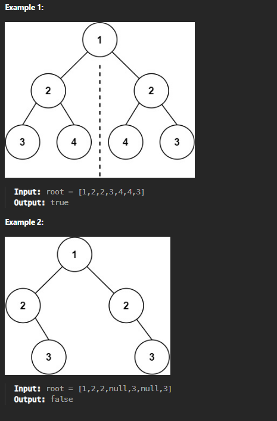

101. Symmetric Tree

Given the root of a binary tree, check whether it is a mirror of itself (i.e., symmetric around its center).

Constraints:
The number of nodes in the tree is in the range [1, 1000].
-100 <= Node.val <= 100
 